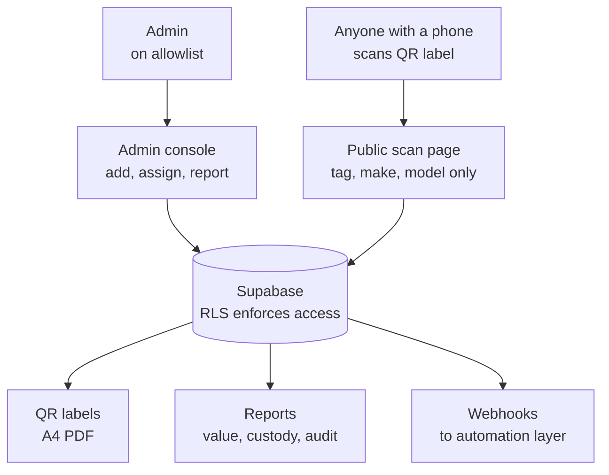
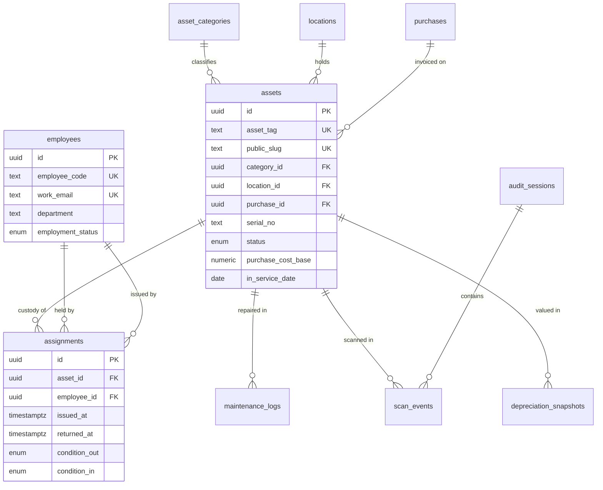
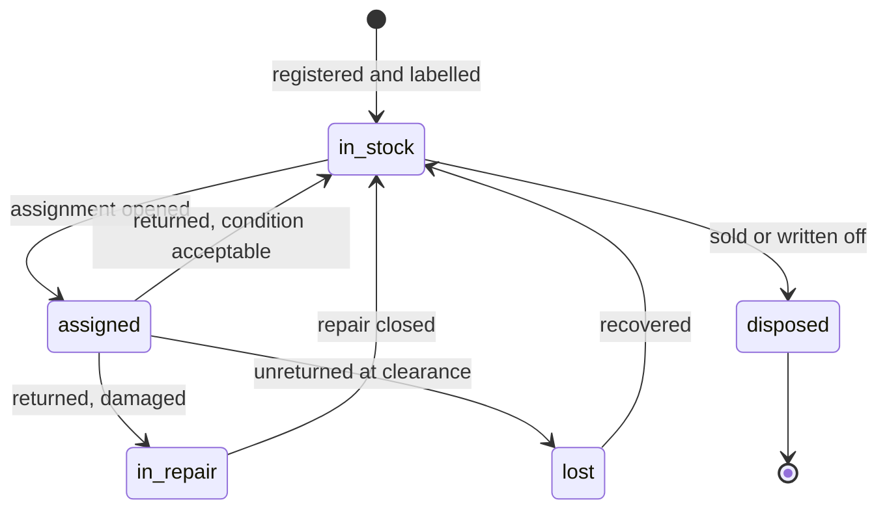

# Functional Specification Document
## Internal Asset Management System

**Version:** 1.0
**Status:** For development
**Platform:** Lovable (React + Tailwind + shadcn/ui + Supabase)
**Audience:** Implementing developer

---

## 1. Purpose & Scope

### 1.1 Problem

Physical assets (laptops, monitors, peripherals, furniture, phones) are currently tracked informally. There is no authoritative record of:

- What the company owns
- Who currently holds each item
- What was paid for it and what it is worth now
- What has been returned at offboarding

### 1.2 Objective

A single internal web application that maintains an authoritative asset register, links every asset to a custodian with a signed acknowledgment trail, exposes each asset via a printed QR label, and computes depreciation for accounting.

### 1.3 In scope

Asset register · QR tagging and label printing · Assignment and return custody chain · Offboarding asset clearance · Purchase and depreciation records · Maintenance logs · Physical audit sweeps · Reporting.

### 1.4 Out of scope (v1)

Procurement approval workflows · Vendor management · Payroll or HR data beyond employee identity · Native mobile app · IoT / GPS tracking · Multi-company or multi-entity support.

### 1.5 Success criteria

1. Every physical asset above the consumable threshold has a unique tag and a QR label affixed.
2. Any staff member can scan a label with a standard phone camera and reach the asset record without installing software.
3. For any employee, the system returns a complete list of items in their custody in one view.
4. Month-end depreciation can be exported without manual recalculation.

---

### 1.6 System overview

Two ways in, one database, three kinds of output. Access is decided entirely by whether the request is authenticated.



The public scan page is not a reduced version of the console. It is a separate, minimal read path with its own restricted field set (§6.4) and no grants on any base table.

---

## 2. Users & Roles

There is **one authenticated role only**. There is no staff, manager, or viewer tier. Access is binary: either a user is an approved administrator with full rights, or they are anonymous and see the public scan page.

| Actor | Capabilities |
|---|---|
| **Admin** (authenticated) | Full CRUD on all entities. Manage categories, locations, employees, purchases. Assign and receive returns. Run depreciation. Export accounting reports. Dispose assets. Manage the admin allowlist. |
| **Anonymous** (unauthenticated) | Read-only view of a single asset reached via its QR link. Restricted field set only (see §6.4). No listing, no search, no enumeration. |

### 2.1 Admin allowlist — mandatory

Because the authenticated role carries full access, **domain-wide sign-in must not be permitted.** Restricting Google OAuth to the company Workspace domain is insufficient on its own: it would grant every employee full administrative access to the register, including purchase costs and valuations.

Required implementation:

- An `app_admins` table holding approved email addresses, `is_active`, and `added_by`.
- A Postgres function `is_admin()` that resolves `auth.jwt() ->> 'email'` against an active row in `app_admins`.
- Every RLS policy on every table is written against `is_admin()`, not against `auth.role() = 'authenticated'`.
- A successful OAuth login by a non-allowlisted address must land on an "access not granted" screen with **no data fetched**.
- The first admin is seeded by migration. Subsequent admins are added only through the app by an existing admin.

### 2.2 Enforcement

**Authorization is enforced at the database layer via Supabase Row Level Security.** UI-level checks are for convenience only and must never be the sole control. Every table requires explicit RLS policies. No table may be left with RLS disabled — including lookup tables such as `asset_categories` and `locations`.

The anonymous role has **no grants on any base table**. Its only access path is a single security-definer function or restricted view returning the public scan fields for one asset, looked up by `public_slug` (see §6.4).

Authentication: Supabase Auth, Google OAuth, restricted to the company Workspace domain **and** filtered through the allowlist above. No password-based signup. No self-service registration.

---

## 3. Data Model

### 3.1 Conventions

- Primary keys are UUIDs. Business identifiers (asset tag, employee ID) are unique-indexed columns, never primary keys.
- All tables carry `created_at`, `updated_at`, `created_by`.
- Deletions are soft (`deleted_at`) for `assets` and `employees`. Custody history must never be destroyed.
- All timestamps stored UTC, displayed in Asia/Karachi.

### 3.2 Tables

#### `asset_categories`
| Field | Type | Notes |
|---|---|---|
| id | uuid PK | |
| name | text | e.g. "Laptop", "Monitor", "Office Chair" |
| tag_prefix | text | 2–3 chars, unique. e.g. `LT`, `MN`, `CH` |
| is_depreciable | boolean | False for consumables |
| default_useful_life_months | integer | Book depreciation |
| default_tax_depr_rate | numeric | Reducing-balance %, nullable |
| is_physical | boolean | False for software licences (§9.2) |

#### `locations`
| Field | Type | Notes |
|---|---|---|
| id | uuid PK | |
| name | text | e.g. "Floor 2 — Dev Bay" |
| type | enum | `desk` / `room` / `store` / `offsite` |
| parent_id | uuid FK → locations | Optional nesting |

#### `employees`
| Field | Type | Notes |
|---|---|---|
| id | uuid PK | |
| employee_code | text unique | External HR identifier |
| full_name | text | |
| work_email | text unique | Used to match auth identity |
| department | text | |
| designation | text | Display only |
| date_of_joining | date | Nullable |
| employment_status | enum | `active` / `notice` / `exited` |

Populated by import (§8). **No compensation, national ID, date of birth, or banking fields are to exist in this schema.**

#### `purchases`
| Field | Type | Notes |
|---|---|---|
| id | uuid PK | |
| vendor_name | text | |
| invoice_no | text | |
| invoice_date | date | |
| currency | char(3) | ISO code |
| amount_original | numeric | In invoice currency |
| fx_rate_on_invoice_date | numeric | To base currency |
| amount_base | numeric | Computed on write, stored |
| warranty_until | date | Nullable |
| attachment_url | text | Supabase Storage reference |

One purchase may cover many assets. Per-asset cost is stored on the asset, not derived by division, since invoices mix line items.

#### `assets`
| Field | Type | Notes |
|---|---|---|
| id | uuid PK | |
| public_slug | text unique | 8-char URL-safe, for QR (§6.2) |
| asset_tag | text unique | Generated, see §6.1 |
| category_id | uuid FK | |
| make | text | |
| model | text | |
| serial_no | text | Nullable, indexed |
| condition | enum | `new` / `good` / `fair` / `poor` |
| status | enum | `in_stock` / `assigned` / `in_repair` / `lost` / `disposed` |
| location_id | uuid FK | Current physical location |
| purchase_id | uuid FK | Nullable (legacy/gifted items) |
| purchase_cost_base | numeric | Per-unit cost |
| in_service_date | date | Depreciation start; may differ from invoice date |
| useful_life_months | integer | Overrides category default |
| salvage_value | numeric | Default 0 |
| notes | text | |

**`current_value` is never stored as a column.** It is computed on read (§7).

#### `assignments`
| Field | Type | Notes |
|---|---|---|
| id | uuid PK | |
| asset_id | uuid FK | |
| employee_id | uuid FK | |
| issued_at | timestamptz | |
| issued_by | uuid FK → employees | |
| condition_out | enum | |
| returned_at | timestamptz | Null = currently held |
| received_by | uuid FK → employees | Nullable |
| condition_in | enum | Nullable |
| acknowledgment_at | timestamptz | When custodian confirmed |
| acknowledgment_method | enum | `in_app` / `signature_image` |
| signature_url | text | Nullable |
| notes | text | |

**Append-only.** Rows are never deleted or hard-updated after return. A partial unique index must enforce: one row per `asset_id` where `returned_at IS NULL`.

#### `maintenance_logs`
| Field | Type | Notes |
|---|---|---|
| id | uuid PK | |
| asset_id | uuid FK | |
| logged_at | date | |
| type | enum | `repair` / `service` / `upgrade` / `inspection` |
| vendor_name | text | Nullable |
| cost_base | numeric | |
| downtime_days | integer | |
| description | text | |

#### `scan_events`
| Field | Type | Notes |
|---|---|---|
| id | uuid PK | |
| asset_id | uuid FK | |
| scanned_by | uuid FK → employees | Null if public scan |
| scanned_at | timestamptz | |
| purpose | enum | `lookup` / `audit` / `assign` / `return` |
| audit_session_id | uuid FK | Nullable, see §9.1 |

#### `depreciation_snapshots`
| Field | Type | Notes |
|---|---|---|
| id | uuid PK | |
| asset_id | uuid FK | |
| period | date | First day of month |
| method | enum | `straight_line` / `reducing_balance` |
| opening_value | numeric | |
| charge | numeric | |
| closing_value | numeric | |

Unique on (`asset_id`, `period`, `method`). Once written, a period is immutable; corrections are made by a reversing entry, not an update.

#### `audit_sessions`
| Field | Type | Notes |
|---|---|---|
| id | uuid PK | |
| name | text | e.g. "Q3 2026 Sweep" |
| started_at / closed_at | timestamptz | |
| scope_location_id | uuid FK | Nullable = whole office |
| conducted_by | uuid FK | |

---

### 3.3 Entity relationships



`app_admins` (§2.1) stands outside this graph. It is referenced only by RLS policies, never by foreign key.

**The load-bearing relationship is `assets → assignments`.** It is one-to-many over time but must be one-to-one at any given moment: a partial unique index on `asset_id WHERE returned_at IS NULL` is what enforces "an item is with one person at a time", and it must exist at the database level rather than being checked in application code.

---

## 4. Functional Requirements

### 4.0 Asset status lifecycle

Every asset sits in exactly one status. These are the only permitted transitions; anything else is a bug.



Notes:
- `in_repair` requires an open `maintenance_logs` row (FR-6.2).
- `lost` and `disposed` both stop depreciation accrual from that month.
- No transition deletes an `assignments` row. History is append-only in every case.


### FR-1 — Asset Register

- **FR-1.1** Create, read, update and soft-delete assets. Required on create: category, make, model, condition, location.
- **FR-1.2** Asset tag auto-generated on insert (§6.1). Not user-editable after creation.
- **FR-1.3** List view with server-side pagination, filter by category / status / department / location / custodian, and free-text search across tag, make, model, serial.
- **FR-1.4** Bulk CSV import with column mapping, dry-run preview, per-row validation errors, and partial-success reporting. Duplicate serial numbers must be flagged, not silently accepted.
- **FR-1.5** Bulk edit of location and status for a multi-select of assets.
- **FR-1.6** Asset detail page showing: identity, purchase data, computed current value, current custodian, full assignment history, maintenance history, scan history.

### FR-2 — Custody (Assign / Return)

- **FR-2.1** Assign an in-stock asset to an employee. Creates an `assignments` row and sets asset status to `assigned`.
- **FR-2.2** An asset with an open assignment cannot be reassigned without a return. The system must block this at the database level, not only in the UI.
- **FR-2.3** Return flow captures return date, receiving user, and condition on return. Sets asset status to `in_stock` or `in_repair`.
- **FR-2.4** Acknowledgment: custodians do not hold accounts, so acknowledgment is captured by the admin at handover — either an on-screen signature drawn on the admin's device, or an uploaded signature image. Assignments with no acknowledgment after 3 days appear on an exceptions list.
- **FR-2.5** Transfer: a single action that closes the current assignment and opens a new one atomically, in one transaction.

### FR-3 — Offboarding Clearance

- **FR-3.1** Per-employee clearance view listing every asset with an open assignment.
- **FR-3.2** Each line item can be marked returned, marked lost, or marked pending, with notes.
- **FR-3.3** Clearance status is `complete` only when zero open assignments remain.
- **FR-3.4** When an employee's `employment_status` changes to `notice` or `exited`, a clearance record is created automatically and a webhook fires (§10).
- **FR-3.5** Exportable clearance certificate (PDF) listing items returned and their condition.

### FR-4 — QR & Labels

- **FR-4.1** Each asset has a stable `public_slug` generated at creation and never changed.
- **FR-4.2** QR encodes a canonical scan URL (§6.2), not the raw tag or a JSON payload.
- **FR-4.3** Batch label generation: select N assets → produce a print-ready A4 PDF on a configurable grid (default 40 × 25 mm, 5 columns × 11 rows).
- **FR-4.4** Label content is restricted to: QR code, asset tag text, and a fixed ownership line. **Serial numbers and custodian names must not appear on labels.**
- **FR-4.5** Reprint of a single label from the asset detail page.
- **FR-4.6** In-browser camera scanning inside the app, available to signed-in admins, opening the asset record directly. Anonymous users scan with their native phone camera and reach the public page (§6.4); no in-app scanner is exposed to them.

### FR-5 — Purchases & Depreciation

- **FR-5.1** Record purchases with vendor, invoice reference, date, currency, amount, FX rate, warranty date, and file attachment.
- **FR-5.2** Link one purchase to many assets; assign per-unit cost per asset.
- **FR-5.3** Compute current book value on demand using straight-line (§7.1).
- **FR-5.4** Compute tax-basis written-down value using reducing balance, at a rate configurable per category (§7.2).
- **FR-5.5** Month-end job writes a `depreciation_snapshots` row per depreciable asset per method.
- **FR-5.6** Depreciation register export (CSV/XLSX) for a selected period: opening value, additions, charge, disposals, closing value — grouped by category.
- **FR-5.7** Disposal flow: record disposal date, method, proceeds; system computes gain or loss against written-down value and sets status to `disposed`.

### FR-6 — Maintenance

- **FR-6.1** Log a maintenance event against an asset with type, vendor, cost, downtime and description.
- **FR-6.2** Setting status to `in_repair` requires an open maintenance log.
- **FR-6.3** Asset detail displays cumulative maintenance spend and flags assets where cumulative repair cost exceeds a configurable percentage of purchase cost (default 40%).

### FR-7 — Audit Sweeps

- **FR-7.1** Start an audit session, optionally scoped to a location.
- **FR-7.2** Mobile-friendly rapid-scan mode: continuous camera scanning, each scan logged against the session with minimal confirmation taps.
- **FR-7.3** Live session view: expected count, scanned count, remaining.
- **FR-7.4** On close, produce a reconciliation report — found, not found, found in unexpected location, scanned but not on register.
- **FR-7.5** Bulk action to update location for all assets found in the wrong place.

### FR-8 — Reporting

Dashboard and exports covering:

- Asset count and net book value by category and by department
- Assets by status
- Unassigned / in-stock inventory
- Warranty expiring within 60 days
- Assets in repair beyond a threshold duration
- Open assignments for employees on notice
- Assets with no scan event in the last N months

All reports exportable to CSV.

---

## 5. Non-Functional Requirements

| Area | Requirement |
|---|---|
| Performance | List views paginate server-side; page load under 2s at 1,000 asset rows. Scan page resolves under 1s. |
| Concurrency | Assignment and return operations must be transactional. No two users may open concurrent assignments on one asset. |
| Availability | Internal tool; standard Supabase availability is acceptable. No HA requirement. |
| Browser support | Current Chrome, Safari, Edge, Firefox. Camera scanning requires HTTPS. |
| Responsive | Assign, return, scan and audit views must be fully usable at 375px width. Admin/reporting views may assume desktop. |
| Auditability | Every write to `assets`, `assignments` and `purchases` records actor and timestamp. |
| Data retention | Custody and depreciation history retained indefinitely. |
| Accessibility | Keyboard-navigable forms; visible focus states; contrast per WCAG AA. |
| Localisation | Base currency PKR. Display timezone Asia/Karachi. UI English only. |

---

## 6. Detailed Design Notes

### 6.1 Asset tag format

```
{COMPANY}-{CATEGORY_PREFIX}-{YY}-{SEQ}
```

Example: `KDX-LT-26-0042`

- `SEQ` is a zero-padded 4-digit sequence, **per category per year**.
- Generated inside a database function using a sequence table with row-level locking to prevent duplicates under concurrent inserts. Do not generate tags client-side.
- Immutable once assigned.

### 6.2 QR payload

Encode exactly:

```
https://{app-domain}/a/{public_slug}
```

Rationale: any phone camera resolves it without an app; the short payload yields a low-density QR that remains scannable at 15mm; and the slug indirection means the URL never leaks the tag scheme or record count.

`public_slug`: 8 characters, generated from a URL-safe alphabet excluding visually ambiguous characters (`0`, `O`, `I`, `l`, `1`). Collision-checked on insert.

QR settings: error correction level M, quiet zone 4 modules, minimum printed size 15 × 15 mm.

### 6.3 Consumable threshold

Categories with `is_depreciable = false` are tracked for custody only and excluded from all depreciation calculations and value reporting. Intended for cables, mice, keyboards, chargers, and similar low-value items. The threshold value is a configuration setting, not hard-coded.

### 6.4 Public scan page

This page is the only surface anonymous users can reach, and it is the surface most staff will use day to day. It exposes **only**: asset tag, category, make, model, status label, and a fixed "property of" contact line.

It must **not** expose: serial number, purchase cost, current value, custodian identity, location, notes, or maintenance history.

A scan by a signed-in admin redirects to the full asset detail page with quick actions (assign, return, log maintenance, mark location).

The endpoint must be rate-limited by IP and must return an identical generic "not found" response for both an invalid slug and a soft-deleted asset, so the slug space cannot be probed for valid records.

---

## 7. Depreciation Logic

Two independent tracks are maintained. They serve different consumers and must never be merged into one figure.

### 7.1 Book value — straight-line

```
monthly_charge = (purchase_cost_base − salvage_value) / useful_life_months

months_elapsed  = full months between in_service_date and calculation_date

book_value      = max(
                    salvage_value,
                    purchase_cost_base − (monthly_charge × months_elapsed)
                  )
```

Rules:
- Depreciation begins in the month following `in_service_date`.
- Book value floors at `salvage_value` and never goes negative.
- Disposed assets stop accruing from the disposal month.

### 7.2 Tax basis — reducing balance

```
annual_charge = opening_written_down_value × category_tax_rate
closing_wdv   = opening_wdv − annual_charge
```

Rates are configured per category by an Admin. **The developer must not hard-code statutory rates.** They are to be entered through the category settings UI and are the finance owner's responsibility to keep current.

### 7.3 Month-end job

A scheduled function (Supabase cron or external scheduler) runs on the 1st of each month and writes one snapshot row per depreciable asset per method for the prior period. The job must be idempotent — re-running for an already-closed period must be a no-op, not a duplicate insert.

---

## 8. Employee Data Import

### 8.1 Source

A spreadsheet export of the employee register, imported either by file upload or by a scheduled sync from a sheet.

### 8.2 Accepted columns

`employee_code`, `full_name`, `work_email`, `department`, `designation`, `date_of_joining`, `employment_status`, `location`

**Any column outside this list must be ignored by the parser.** Compensation, national identity numbers, dates of birth and banking details are explicitly excluded from this system.

### 8.3 Reconciliation rules

| Condition | Action |
|---|---|
| `employee_code` matches existing record | Update name, department, designation, status. Assignment history untouched. |
| `employee_code` not present in database | Insert new record. |
| Existing record absent from import file | **Flag for review. Do not delete.** Deleting would orphan assignment rows. |
| `employment_status` transitions to `notice` or `exited` | Trigger offboarding clearance (FR-3.4). |

### 8.4 Import safety

- Dry-run preview showing counts of inserts, updates, and flagged records before commit.
- Import runs in a single transaction; any fatal error rolls back entirely.
- Every import writes a summary log record.

---

## 9. Extended Features

### 9.1 Audit sessions
Covered in FR-7. Design the rapid-scan interface for one-handed phone use — large tap targets, audible confirmation, no modal dialogs between scans.

### 9.2 Software licence register
Reuses `assets` and `assignments` with `is_physical = false` on the category. Differences: no QR label, no physical location, `serial_no` holds the licence key, and a `renewal_date` field replaces `warranty_until`. Seat assignment uses the same custody model. Implement only after §11 Phase 3.

### 9.3 Spares / store view
Filtered view of `status = in_stock`, grouped by category, showing available quantity per model. Purpose is to prevent duplicate purchasing.

---

## 10. Integrations

Notifications are **not** built inside the application. The app fires outbound webhooks to an existing automation layer, which owns message delivery.

| Event | Payload |
|---|---|
| `assignment.created` | asset tag, custodian, issued date |
| `assignment.unacknowledged` | asset tag, custodian, days outstanding |
| `employee.offboarding_started` | employee code, count of open assignments |
| `asset.warranty_expiring` | asset tag, warranty end date |
| `asset.repair_overdue` | asset tag, days in repair |
| `audit.session_closed` | session id, found / missing counts |

Webhook endpoint URL and shared secret are configuration values. Payloads must not contain purchase cost or valuation data.

---

## 11. Delivery Phases

| Phase | Scope | Exit criteria |
|---|---|---|
| **1 — Register** | Auth + admin allowlist + RLS, categories, locations, assets CRUD, CSV import, tag generation, QR generation, batch label PDF, public scan page | Full inventory can be catalogued and labelled |
| **2 — Custody** | Employee import, assign / return / transfer, acknowledgment, offboarding clearance, clearance PDF | No asset can leave the building without a record |
| **3 — Financial** | Purchases, depreciation engine, month-end job, disposal flow, accounting exports | Finance can pull a depreciation register unassisted |
| **4 — Operations** | Maintenance logs, audit sessions, dashboards, webhooks, software licence register | Quarterly audit runs end to end |

Phases 1 and 2 constitute the minimum viable system. Phases 3 and 4 must not be started until 1 and 2 are in production use.

---

## 12. Acceptance Criteria

The build is accepted when all of the following hold:

1. A new asset can be created, tagged, labelled, printed and scanned to its public page without developer intervention.
2. Attempting to assign an already-assigned asset fails at the database level, verified by direct SQL, not only through the UI.
3. A Workspace account **not** on the admin allowlist can complete Google sign-in but receives zero rows from every table, verified by direct query against the Supabase client API — not merely a blocked screen.
4. Using the public anon key while logged out, a direct query against `assets`, `purchases`, `employees` and `assignments` returns zero rows, and the public scan endpoint returns no restricted field.
5. Setting an employee to `exited` produces a clearance record listing exactly their open assignments.
6. Running the month-end job twice for the same period produces no duplicate snapshot rows.
7. A CSV import of 200 rows containing 5 deliberate errors imports 195 rows and reports the 5 with row numbers and reasons.
8. All assign, return and scan screens are operable on a 375px viewport.

---

## 13. Assumptions & Open Items

**Assumptions**
- Asset volume is in the low hundreds; no partitioning or search-index infrastructure is required.
- Single office location; the `locations` table supports nesting but multi-site is untested.
- Base currency is PKR; FX handling is limited to recording a historic rate at purchase.

**To be confirmed before Phase 3**
- Consumable threshold value
- Per-category useful lives and tax depreciation rates
- Whether signature capture must be a drawn signature or an in-app confirmation is sufficient
- Label stock dimensions and printer model, which determine the PDF grid defaults

---

*End of document.*
